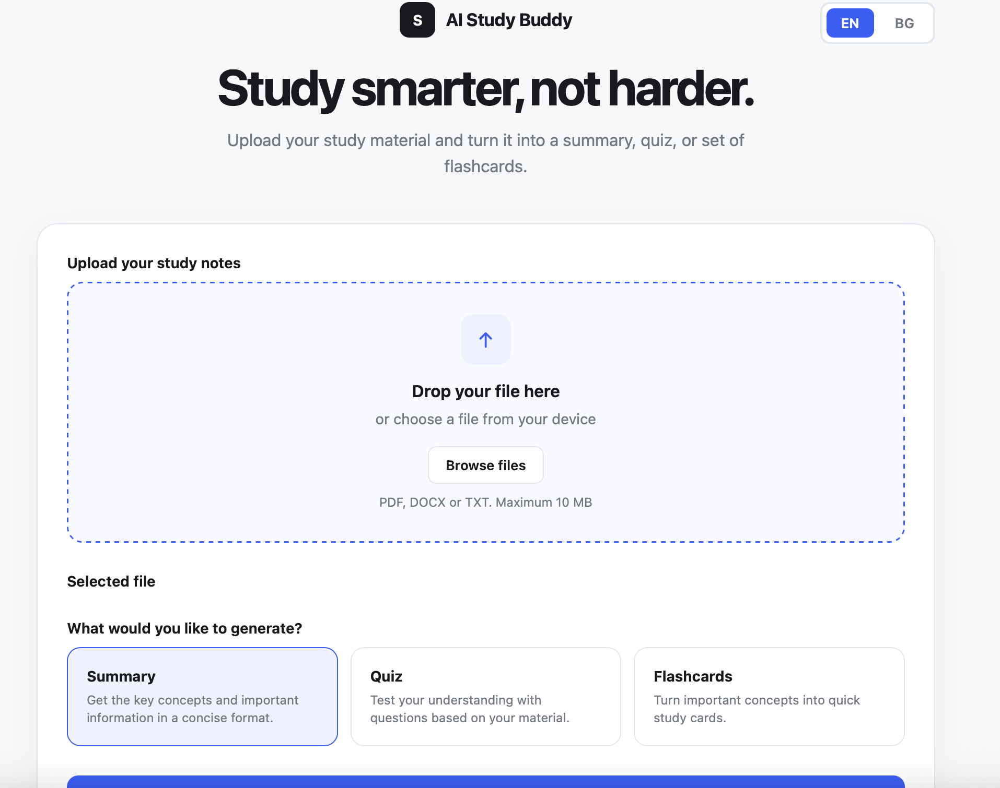

# AI Study Buddy

A privacy-first, local-capable study companion that transforms lecture notes, textbooks, and reading materials into interactive study tools — summaries, multiple-choice quizzes, and flip flashcards.

Runs locally by default via **Ollama**, or connects to any OpenAI-compatible API endpoint.



---

## Key Features

* **Multi-Format Document Parsing** — Extracts and sanitizes text from `.pdf`, `.docx` (including tables), and `.txt` files with strict MIME-type sniffing and scanned-page detection.
* **Concise, Concept-Preserving Summaries** — Strips fluff while preserving technical terms, formulas, and domain definitions.
* **Interactive Quizzes** — Structured multiple-choice assessments with immediate feedback, detailed explanations for correct answers, and final score reporting.
* **3D Flip Flashcards** — Question-answer flashcard decks with smooth flip transitions and keyboard/button navigation.
* **Guaranteed Structured Output** — Uses Pydantic schema parsing and runtime validators to guarantee correct option counts, valid answer indices, and expected deck sizes.
* **Bilingual UI** — Built-in language switching between English and Bulgarian (EN / BG).
* **Local & Private by Default** — Ships configured for local inference with `qwen2.5:7b-instruct` via Ollama. No third-party data transmission or API subscriptions required.

---

## Architecture Overview

```
                      ┌───────────────────────┐
                      │   Web Browser (UI)    │
                      │  Vanilla JS + CSS3    │
                      └───────────┬───────────┘
                                  │ Multipart Upload / JSON
                                  ▼
                      ┌───────────────────────┐
                      │   FastAPI Backend     │
                      └───────────┬───────────┘
                                  │
         ┌────────────────────────┼────────────────────────┐
         ▼                        ▼                        ▼
┌──────────────────┐    ┌──────────────────┐    ┌──────────────────┐
│  FileValidator   │    │  Text Extractor  │    │  AIService / LLM │
│ • MIME sniffing  │    │ • pypdf          │    │ • Ollama / OpenAI│
│ • Size / Length  │    │ • python-docx    │    │ • Structured Pydantic
│ • Corrupt/Scanned│    │ • UTF-8 decoding │    │ • Error translation
└──────────────────┘    └──────────────────┘    └──────────────────┘
```

### Validation & Fault-Tolerance Highlights

* **MIME Sniffing**: Uses `python-magic` to inspect file headers rather than blindly trusting the file extension.
* **Scanned PDF Handling**: Flags image-only or un-decrypted PDFs early and warns the user instead of sending blank inputs to the LLM.
* **Output Validation**: Validates the model's generated output using custom validators ([`ai_service_validator.py`](src/ai_study_buddy/validators/ai_service_validator.py)) to catch malformed structures, missing keys, or out-of-bounds indices before they reach the UI.
* **Resilient Error Translation**: Automatically maps connection drops, rate limits, timeouts, and context length overflows into standardized HTTP exceptions.

---

## Quickstart

### Prerequisites

* Python 3.11+
* [uv](https://github.com/astral-sh/uv) (recommended package manager)
* [Ollama](https://ollama.com/) (for running locally)
* [Gemini API key](aistudio.google.com/app/apikey) (for running using a free Gemini api key)

### 1. Clone & Install

```bash
git clone https://github.com/IvanKrstv/ai-study-buddy.git
cd ai-study-buddy

# Install dependencies using uv
uv sync
```

### 2. Configure Environment

Create a `.env` file in the project root:

```bash
cp .env.example .env   # if available, or create manually:
```

```ini
# Default: Local Ollama
LLM_BASE_URL="http://localhost:11434/v1"
LLM_API_KEY="ollama"
LLM_MODEL="qwen2.5:7b-instruct"

# Optional: Fine-tune temperatures
# LLM_SUMMARY_TEMPERATURE=0.3
# LLM_STRUCTURED_TEMPERATURE=0.2

# Alternatively, to use Gemini (comment everything above, including this line):
# LLM_BASE_URL=https://generativelanguage.googleapis.com/v1beta/openai/
# LLM_API_KEY=your-gemini-key
# LLM_MODEL=gemini-3.5-flash-lite
```

If using Ollama, pull the default model:

```bash
ollama run qwen2.5:7b-instruct
```

### 3. Run the Application

```bash
uv run fastapi dev src/ai_study_buddy/main.py
```

Open your browser at **http://localhost:8000** to use the application.

---

## API Reference

| Endpoint | Method | Input | Description |
| :--- | :--- | :--- | :--- |
| `/` | `GET` | — | Serves the web interface |
| `/extract` | `POST` | `multipart/form-data` (`file`) | Extracts raw text from an uploaded document |
| `/generate/summary` | `POST` | `multipart/form-data` (`file`) | Extracts text and produces a structured summary |
| `/generate/quiz` | `POST` | `multipart/form-data` (`file`) | Generates a 5-question multiple choice quiz |
| `/generate/flashcards` | `POST` | `multipart/form-data` (`file`) | Generates a deck of 5 flashcards |

---

## Testing

The project includes unit and integration tests covering the file validation pipeline, edge-case rejection (e.g. spoofed extensions, oversize inputs, blank texts), and mocked API endpoint execution.

Run the test suite with:

```bash
uv run pytest
```

---

## Project Structure

```
ai-study-buddy/
├── src/
│   └── ai_study_buddy/
│       ├── config.py           # Pydantic BaseSettings (.env loader)
│       ├── main.py             # FastAPI entrypoint & route handlers
│       ├── models/             # Pydantic response models for structured outputs
│       ├── services/
│       │   ├── ai_service.py   # LLM interaction & prompt pipelines
│       │   └── file_service.py # PDF / DOCX / TXT extraction
│       ├── static/             # Frontend web interface (HTML/CSS/JS)
│       └── validators/         # File, LLM response, and error mapping logic
├── tests/
│   ├── test_api.py             # Endpoint integration tests
│   └── test_file_validator.py  # Validation unit tests
├── pyproject.toml              # Dependencies and build configuration
└── LICENSE                     # MIT License
```

---

## License

This project is licensed under the [MIT License](LICENSE).
